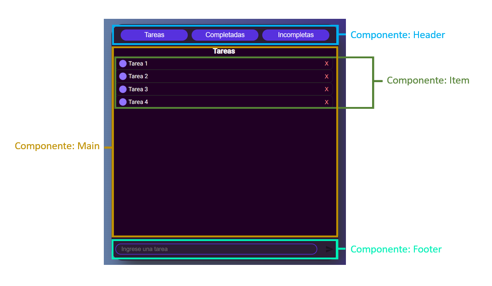
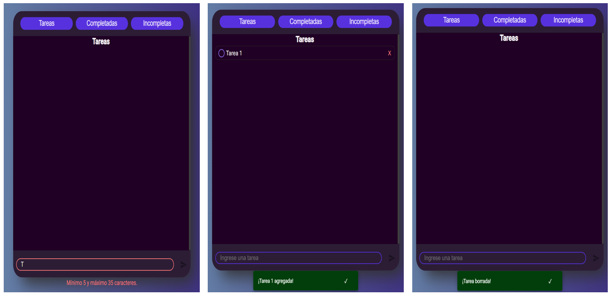
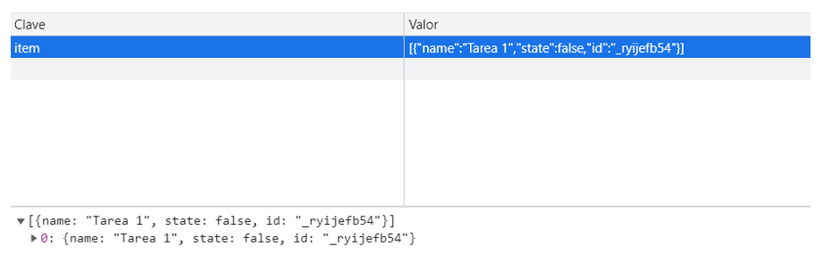

# ```Lista de tareas - Angular```

Este proyecto fue realizado de forma autodidacta con la intención de profundizar en los conceptos principales de Angular, como los componentes, servicios, pipes y modelos. Para lograrlo, se desarrolló una lista de tareas ocupando la tecnología que ofrece Angular y RxJS.

La lista de tareas cuenta con varias características destacables. Una de ellas es el almacenamiento de información en el LocalStorage. Además, el proyecto incorpora validaciones al momento de ingresar el nombre de una tarea, lo que asegura que los datos ingresados cumplan con un formato adecuado. También se ha implementado la funcionalidad de cambiar el color del borde del campo de texto según los datos ingresados cumplan con el formato establecido.  
Debido a que se generaron los archivos estáticos del proyecto, es posible visualizar el sitio web en ejecución a través de la siguiente URL: https://justfym.github.io/ListaDeTareas_Angular/


### Tecnología
<p align="center">


</p>

## Componentes
<p align="center">

</p>


### Algunas variables del ```Servicio``` item.service.ts

``` TS
private sub = new Subject<TaskModel[]>();
item$ = this.sub.asObservable();

private subFilter = new Subject<string>();
codeFilter$ = this.subFilter.asObservable();
```

La variable privada "sub" es un objeto de la clase Subject que permite emitir valores de tipo TaskModel[] y la variable pública "item$" es un Observable al cual se pueden suscribir los otros 
componentes para obtener las tareas de la aplicación.

La variable privada "subFilter" es otro objeto de la clase Subject que permite emitir valores de tipo string y la variable pública "codeFilter$" es un Observable al cual se pueden suscribir 
los otros componentes para obtener el código de filtro para mostrar las tareas correspondientes.

### Flujo de la aplicación

La aplicación contiene un componente ```Header``` que emite un valor para filtrar las tareas, y el componente ```Main``` lo recibe y cambia el nombre de la vista gráfica según corresponda (***Tareas, Completadas, Incompletas***). El componente ```Main``` también recibe la lista de tareas desde el servicio ItemService en la variable listItems. Cada componente ```Item``` recibe una tarea individual y su estado desde el componente 
padre ```Main``` mediante el decorador @Input(), y permite cambiar el estado de la tarea o borrarla ocupando los métodos del servicio ItemService. El archivo HTML del componente ```Main``` recorre la 
lista de tareas y las filtra según el código enviado desde el componente ```Header``` ocupando el método filterItems declarado en un pipe.
El componente ```Footer``` tiene el cometido de permitir al usuario agregar nuevas tareas a la lista de tareas. El archivo HTML define la estructura visual de la sección del pie de página y 
contiene un campo de entrada de texto y un botón para guardar la tarea ingresada. También tiene una sección para mostrar mensajes de validación en caso de que el usuario ingrese una tarea 
con menos de 5 o más de 35 caracteres. El componente ```Footer``` se encarga de la lógica detrás de la interacción del usuario con la sección del pie de página. Contiene una variable items para 
almacenar la lista de tareas y un objeto FormControl para gestionar la entrada de texto del usuario. También contiene un método save() para agregar la tarea ingresada a la lista de tareas 
y un método onInputChange() para validar la entrada de texto del usuario. Además, ocupa el servicio ItemService para agregar la tarea a la lista y el MatSnackBar para mostrar una 
notificación de confirmación de que la tarea ha sido agregada.

## Validación de formulario / Agregar Tarea / Borrar Tarea
<p align="center">

</p>

## Almacenamiento de la información en el LocalStorage
<p align="center">

</p>